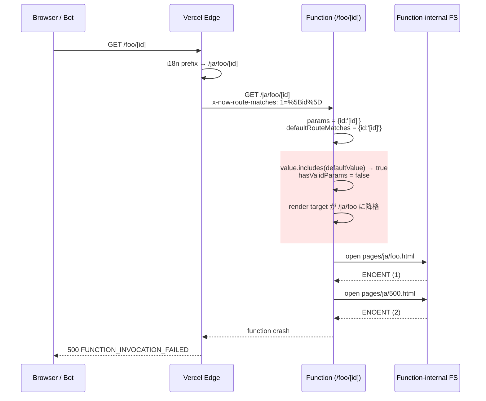

# Vercel 本番での Next.js URL 解釈の仕組み

本ドキュメントは [`vercel-bracket-500-root-cause.md`](./vercel-bracket-500-root-cause.md) で記述した「2 段 ENOENT」が **なぜ起きるか** を Vercel の架構レベルから解説したものです。Zenn 記事の図解検討用メモも兼ねます。

公式ドキュメントには断片的にしか書かれていない領域なので、内容の一部は Next.js source とログからの逆算です（末尾の「確信度」セクション参照）。

---

## 全体像: 3 層構造

```
┌─────────────────────────────────────────────────────────┐
│  ① Vercel Edge Network (CDN / Router)                   │  ← request 入口
│     - routes.json に従って静的アセット/関数を振り分け      │
│     - i18n の locale prefix を付与                       │
│     - x-now-route-matches, x-matched-path 等を inject    │
└─────────────────────────────────────────────────────────┘
                          │
                          ▼ HTTP リクエスト (改変済)
┌─────────────────────────────────────────────────────────┐
│  ② Function Bundle (Lambda / Edge Function)              │
│     - route ごとに **独立した** バンドル                  │
│     - 中身は Next.js server (NextWebServer / NextNodeServer)│
│     - handleCatchallRenderRequest が動く                 │
│     - params 正規化 / ページ resolve / レンダリング       │
└─────────────────────────────────────────────────────────┘
                          │
                          ▼ ファイル参照
┌─────────────────────────────────────────────────────────┐
│  ③ Function Bundle 内ファイルシステム                    │
│     - /var/task/.next/server/pages/*.html (静的)         │
│     - /var/task/.next/server/pages/*.js (動的)           │
│     - **output-tracing で route ごとに別バンドル**         │
│     - 隣の route の .html はそのバンドルには無い           │
└─────────────────────────────────────────────────────────┘
```

---

## ① Vercel Edge Network（リクエスト振り分け）

入口の CDN 層。Next.js のコードではなく Vercel 独自のルーター。ビルド時に Next.js が出力する `.vercel/output/config.json`（または旧 `routes-manifest.json`）の正規表現テーブルを見て URL を振り分けます。

`/foo/[id]` route に対する正規表現はおおむね:

```
^/foo/(?<id>[^/]+?)(?:/)?$                    → /foo/[id] 関数
^/(?<locale>en|ja)/foo/(?<id>[^/]+?)(?:/)?$    → 同じ関数
```

**ここがポイント**: `[id]` という文字列（角括弧含む 4 文字）は `[^/]+?` を素直に満たすので、Edge ルーターから見れば「ただの dynamic param 値」。Edge は何の疑問も持たずに `/foo/[id]` 関数バンドルへ転送する。

Edge は転送時に以下を改変・付与:

- `x-now-route-matches: 1=%5Bid%5D` （params を URL-encoded で渡す）
- `x-matched-path: /ja/foo/[id]` （マッチした route テンプレート、locale 付き）
- pathname に `defaultLocale` の `/ja` prefix を付ける（i18n の場合）

---

## ② Function Bundle（Next.js server がここで動く）

Edge から受け取ったリクエストが Next.js の `handleCatchallRenderRequest` に到達する。関数内の状態遷移を追うと:

| 段階 | `pathname` の値 | `query` / `params` |
|---|---|---|
| 関数入口 | `/ja/foo/[id]` （Edge が locale prefix 付与済） | `{id: '[id]'}` （x-now-route-matches 由来） |
| `normalizedPage` 比較 | template `/foo/[id]` と差分あり → 動的処理 path へ | |
| `dynamicRouteMatcher(pathname)` 実行 | template そのものを matcher にかける | **`defaultRouteMatches = {id: '[id]'}`** ← ここが鍵 |
| `normalizeDynamicRouteParams` 呼出 | | `value='[id]'`, `defaultValue='[id]'` |
| **`.includes()` チェック発火** | | **`hasValidParams = false`** |
| `interpolateDynamicPath` | params 無効化された結果、テンプレを埋められない | pathname が `/ja/foo` に **降格** |
| ファイル解決へ | render target: `/ja/foo` | |

つまり Edge から見た「`/foo/[id]` 関数の dynamic param 取得リクエスト」が、Next.js 内部で **「`/ja/foo`（親 index）のレンダリングリクエスト」に勝手にすり替わる**。

---

## ③ Function Bundle 内 FS（output-tracing の副作用）

一番直感に反する部分。**Lambda / Edge Function のファイルシステムは route ごとに別物**。

ビルド時に Vercel/Next.js は output-tracing でこう振り分ける:

```
/foo/[id] 関数バンドル
├── /var/task/index.js                       ← 関数エントリ
├── /var/task/.next/server/pages/foo/[id].js ← この route の renderer
├── /var/task/.next/server/pages/_app.js
├── /var/task/.next/server/pages/_error.js
└── /var/task/.next/server/pages/foo.html    ← 親 index（出力されてる場合）

  ※ pages/ja/foo.html や pages/en/foo.html は **無い**
     （pure-static は locale 別にファイル化されないから）

  ※ 他の route (例: /bar/[slug]) の HTML/JS も **無い**
     （別 route は別バンドル）
```

Next.js のコードからは「同一プロセスで `pages/` 全部が見える」前提で書かれている部分が多いが、Vercel 本番では **その route の出力以外は物理的に存在しない**。

`/ja/foo` を render しろと言われると `pages/ja/foo.html` を `fs.open` するが ENOENT。fallback で `/ja/500` を試すが `pages/ja/500.html` も無く ENOENT。**2 段で死亡**。

---

## URL の状態遷移を 1 本にまとめると

```
"https://example.com/foo/[id]"
        │
        ▼ ① Vercel Edge
   ┌──────────────────────────────────┐
   │ Method: GET                       │
   │ URL: /ja/foo/[id]   ← locale 付与 │
   │ Headers:                          │
   │   x-now-route-matches: 1=%5Bid%5D │
   │   x-matched-path: /ja/foo/[id]    │
   └──────────────────────────────────┘
        │
        ▼ ② Function entry (NextWebServer.handleCatchallRenderRequest)
   parsedUrl.pathname = "/ja/foo/[id]"
   query = { id: "[id]" }
        │
        ▼ Vercel-specific normalize
   pathname = "/foo/[id]"   ← normalizedPage に差し替え
   query   = { id: "[id]" }
        │
        ▼ defaultRouteMatches 計算
   dynamicRouteMatcher("/foo/[id]") → { id: "[id]" }
        │
        ▼ normalizeDynamicRouteParams 呼出
   value         = "[id]"   (query.id)
   defaultValue  = "[id]"   (defaultRouteMatches.id)
   value.includes(defaultValue)  → true  🔥
   hasValidParams = false
        │
        ▼ interpolateDynamicPath が無効な params で実行
   render target = "/ja/foo"   ← /ja/foo/[id] が消えて親 index に降格
        │
        ▼ ③ FS lookup
   fs.open("/var/task/.next/server/pages/ja/foo.html") → ENOENT (1段目)
   fs.open("/var/task/.next/server/pages/ja/500.html") → ENOENT (2段目)
        │
        ▼
   関数クラッシュ → Vercel: FUNCTION_INVOCATION_FAILED
```

---

## Zenn 記事用の図解アイデア

目的別に 3 案。

### 案 A: シーケンス図（Mermaid `sequenceDiagram`）

**得意**: 「Browser → Edge → Function → FS」 の **時間軸での流れ** と **どこでバグが発火するか** を示す。



技術記事ではこれが一番分かりやすい。**バグ発火点（赤背景の rect ブロック）** が視覚的に強調できる。

### 案 B: レイヤー図（箱と矢印）

**得意**: 「Edge / Function / FS の 3 層構造」 と **output-tracing で FS が route ごとに分かれている** ことを示す。

```
                Vercel Edge Network
   ┌────────────────────────────────────────────────┐
   │  正規表現テーブル                                │
   │   /foo/[^/]+/?     → /foo/[id] 関数            │
   │   /(en|ja)/foo/... → /foo/[id] 関数            │
   └────────────────────────────────────────────────┘
            │                            │
            ▼                            ▼
   ┌────────────────────┐    ┌────────────────────┐
   │ /foo/[id] 関数      │    │ /bar/[slug] 関数    │
   │ ┌────────────────┐ │    │ ┌────────────────┐ │
   │ │ Next.js server │ │    │ │ Next.js server │ │
   │ └────────────────┘ │    │ └────────────────┘ │
   │ ┌────────────────┐ │    │ ┌────────────────┐ │
   │ │ FS:            │ │    │ │ FS:            │ │
   │ │  foo/[id].js   │ │    │ │  bar/[slug].js │ │
   │ │  foo.html ★    │ │    │ │  bar.html      │ │
   │ │  500.html      │ │    │ │  500.html      │ │
   │ │  ✗ ja/foo.html │ │    │ │  ✗ ja/bar.html │ │
   │ │  ✗ ja/500.html │ │    │ │  ✗ ja/500.html │ │
   │ └────────────────┘ │    │ └────────────────┘ │
   └────────────────────┘    └────────────────────┘
```

★ ＝ 「あるけど locale 別じゃない」、✗ ＝ 「物理的に存在しない」。「**route 間で FS が分離されている**」「**locale 別 HTML は生成されていない**」 という 2 つの非自明な事実を 1 枚で見せられる。

### 案 C: 状態遷移テーブル（表）

**得意**: 「同じ pathname という変数が、レイヤを跨いで意味も値も変わる」 ことを示す。

| 段階 | `pathname` の値 | 解釈 |
|---|---|---|
| ユーザー入力 | `/foo/[id]` | HTTP request の URL |
| Edge 後 | `/ja/foo/[id]` | i18n locale 付与済 |
| Function 入口 | `/ja/foo/[id]` | parsedUrl |
| `normalizedPage` 差し替え後 | `/foo/[id]` | route テンプレート |
| `defaultRouteMatches` 計算入力 | `/foo/[id]` | テンプレートを matcher に通す |
| `defaultRouteMatches` 結果 | — | `{id: '[id]'}` |
| `normalizeDynamicRouteParams` 中 | — | `value='[id]'`, `defaultValue='[id]'` |
| `.includes()` 後 | — | `hasValidParams=false` |
| `interpolateDynamicPath` 後 | `/ja/foo` | 親 index に降格 ← **ここがズレ** |
| FS lookup | `/var/task/.next/server/pages/ja/foo.html` | ENOENT |

文字主体だが、**「pathname という同じ変数が 6 種類の意味で使われている」** という Next.js 内部の混乱が露わになる、別の切り口の図表。

---

## 推奨組み合わせ

記事の流れに沿って 2 つ使うのが個人的おすすめ:

1. **「Runtime Log: 2 段 ENOENT の連鎖」セクション直後に → 案 A のシーケンス図**
   - 「結局何がどの順番で起きてるの？」に答える
   - バグ発火点を赤で囲って印象付け
2. **「なぜ Pages Router + i18n だけが顕在化するのか」セクションの直前に → 案 B のレイヤー図**
   - 「`/foo/[id]` 関数のバンドル内に `pages/ja/foo.html` が物理的に無い」という非直感的事実の納得感を作る
   - output-tracing の概念紹介を兼ねる

案 C はテキストでも代替可能なので必須ではない。

---

## 内容の確信度

このドキュメントの記述は、公式情報と逆算情報の混合です。記事化する際は適宜区別したほうが安全:

| 項目 | 確信度 | 根拠 |
|---|---|---|
| ① Edge の正規表現テーブルが `.vercel/output/config.json` 由来 | そこそこ | [Vercel Build Output API](https://vercel.com/docs/build-output-api) ドキュメントとの整合 |
| ② `x-now-route-matches`, `x-matched-path` が Edge → Function で渡される | 強い | Next.js source（`web-server.ts` で読んでいる）+ Vercel 本番ログで実観測 |
| ③ output-tracing で route ごとに FS が分離 | 強い | `@vercel/nft` ベース、ENOENT がそれでしか説明できない |
| Edge と Function の境界が同一プロセスか別 invocation か | 曖昧 | 理論的には別 Lambda 起動だが実装の細部は非公開 |

作図の際、「**Edge と Function は別物として描く**」 までは安全、「**同じプロセスかどうか**」 など細かい部分には触れないのが無難。
